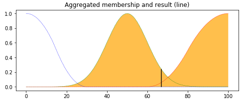

# Project
Gist of Master Thesis
Projects was carried out in IIT Madras incubated Startup ‘Greenvironment India’ headquartered at Chennai India, which mainly works in providing smart technologies for water, energy and environmental management to communities and apartments, through real-time monitoring/ troubleshooting using IOT and Data Analytics.
Main points of Projects were to make the process of monitoring computational easier and explore the possibilities of instilling Machine intelligence into Controller.
Real time monitoring of Water Quality in Treatment plants is one of the prime objectives of company. The quality is gauged using many parameters like pH, Total Dissolved Solids, Oxygen Content etc., all had different and overlapping range and had varying thresholds which were indication of excess or deficiency of certain chemical concentration (like chlorine).
Task was to real time analyse all these parameters and alert whenever anyone transgress acceptable limits, to take preventive action. Complete understanding of all features was difficult for consumers and operators. In quest of building intelligent system and reducing the Dimensionality, we thought of building an Index (range 0-100), which is weighted combination of all features. With initial failures owing to overlapping range, we toned down to Fuzzy based Hybrid Index, where coefficients were fuzzy values, which proved to be stable, adaptable and quick. Operators could get alerts if this index slumped below 60 and highlighted the major contributor, which then they would take specific remedial actions. This also let us enable the controller to accessories like to predict probable future alert situation given the continuation of present conditions.
Energy Management and Intelligent Automation plays an indispensable role in efficient functioning of any plant. Treatment plants usually have many machines installed which are usually at different stages of their service life and task is to get things done by alternatively allocating jobs to these devices, which mostly is done manually or automated by PLCs.
This incurred huge economic losses and accelerate the degradation of equipment’s life. There was a need for a system/ controller which takes a decision after analysing its future consequences.
To realize such intelligence, we modelled equipment’s specifics like Motor/ pump efficiencies, Heat generation, head and friction losses etc. and tried to get an overall idea of how and what kind of effect does the current load has on its health. We simulated this using a model based on Rule based Markov Chains using Bayesian nets and employed reinforcement learning to adaptively learn, as no two treatment plants are same. Rules were objectives to optimize.
By this the controller would accomplish the duty and optimize durability of machine life and minimizing economic cost. Unfortunately, we couldn’t installed this in any plant due to lack of infrastructure but through pure simulation, we achieve a staggering improvement and an annual saving of 100 kW.
This project resulted in Research Paper publication which was awarded Best Paper in 2018.

